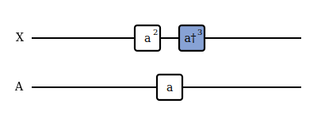
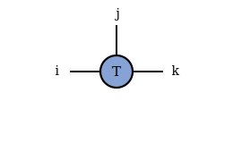
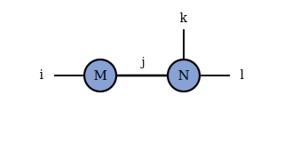
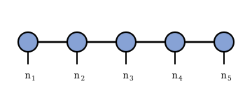
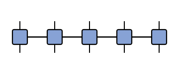

# Doi-Peliti Method

The Doi-Peliti method\cite{Doi:1976,Peliti:1985} is a way of writing the dynamics of a
stochastic chemical reaction network as a single linear operator acting on a vector of
probabilities. Counting molecules instead of tracking concentrations turns each reaction
into a product of simple raising and lowering operators, and the combinatorial factors that
usually have to be inserted by hand appear on their own.

That operator form is also a natural entry point for tensor networks. The probability vector
becomes a [[Matrix Product State|mps]], the generator becomes a [[Matrix Product Operator|mpo]],
and a problem whose size grows as $d^{L}$ becomes one that can be stored and evolved with a
controllable amount of memory.

<a href="https://jamie2111.github.io/reaction_network_builder/"><b>Open the interactive reaction-network builder</b></a> 
assemble a mechanism and watch its operator form and tensor diagrams update as you type.

<!--TOC-->

## Why count molecules instead of concentrations

Most introductions to chemical kinetics track concentrations with ordinary differential
equations. That picture is accurate when there are many molecules of every species, so that a
concentration is effectively a continuous number. It is the wrong picture when a species is
present in only tens or hundreds of copies, as happens for many genes, signalling molecules,
and reactions confined to a small volume. There the count is an integer that jumps by a whole
molecule at each reaction, and the timing of those jumps is random.

The object that captures this behaviour is a probability distribution over integer molecule
counts. If $\mathbf{n}$ lists how many molecules of each species are present, then
$p(\mathbf{n}, t)$ is the probability of that exact configuration at time $t$. Its evolution is
set by the chemical master equation\cite{vanKampen:2007}, a linear rate equation with one term
per reaction. The master equation is easy to write and hard to solve, because the number of
configurations grows very quickly with the number of species and reactions\cite{Gillespie:1977}.

The Doi-Peliti method does not change the physics. It rewrites the same master equation in a
language of operators that makes its structure easier to manipulate, and in particular easier to
hand to a tensor network.

## Reactions as operators

Pick a single species and let $|n\rangle$ stand for the state in which exactly $n$ molecules are
present. These states form a basis, and any probability distribution over counts is a weighted
sum of them,

\begin{equation}
|p(t)\rangle = \sum_{\mathbf{n}} p(\mathbf{n}, t)\, |\mathbf{n}\rangle .
\end{equation}

Two operators move between basis states. The annihilation operator $a$ removes one molecule, and
it multiplies by $n$ because there are $n$ indistinguishable molecules that could be the one
removed. The creation operator $a^{\dagger}$ adds one molecule and carries no extra factor,

\begin{equation}
a\,|n\rangle = n\,|n-1\rangle , \qquad a^{\dagger}\,|n\rangle = |n+1\rangle , \qquad \hat{n} = a^{\dagger} a .
\end{equation}

The combinatorics of a reaction therefore come for free. A step that consumes two molecules of
the same species picks up the factor $n(n-1)$ on its own, with no binomial coefficient inserted
afterwards,

\begin{equation}
a^{2}\,|n\rangle = n(n-1)\,|n-2\rangle .
\end{equation}

One caution about notation. The dagger here is an algebraic label, not a promise that
$a^{\dagger}$ is the Hermitian adjoint of $a$. Doi-Peliti borrows the symbols of second
quantization, but the vector being evolved is an ordinary classical probability distribution, so
the usual quantum inner product does not apply.

As a concrete example, the forward step of the reversible Schlogl model, $2X + A \to 3X$,
removes two $X$ and one $A$ and creates three $X$. Drawing one occupation line per species, with a
box for each operator, gives a small operator diagram:

A shaded box is a creation operator $a^{\dagger}$ and an open box is an annihilation operator $a$;
the exponent records how many molecules are added or removed. The two ends of each line are
external indices: the occupation going in and the occupation coming out.

## Building the generator

Stacking the operators for every reaction gives a single matrix, the generator $\hat{H}$, that
drives the whole distribution. Each reaction contributes two pieces: a gain term that moves
probability into the states it produces, and a loss term that removes probability from the states
it consumes. The gain minus the loss is what keeps total probability fixed at one. The evolution
is then a single linear equation whose formal solution is a matrix exponential,

\begin{equation}
\frac{d}{dt}|p(t)\rangle = \hat{H}\,|p(t)\rangle , \qquad |p(t)\rangle = e^{t\hat{H}}\,|p(0)\rangle .
\end{equation}

Two familiar examples show the pattern before the general rule. A molecule decaying away, and two
molecules combining into one,

\begin{align}
\hat{H}_{A \to \varnothing} &= k\left(a - a^{\dagger} a\right) , \\
\hat{H}_{2A \to B} &= k\left(b^{\dagger} a^{2} - a^{\dagger 2} a^{2}\right) .
\end{align}

In each bracket the left term is the gain and the right term is the loss. Factorial factors from
repeated reactants are often folded into the rate constant to keep the operator compact.

## Reading the operators as tensor diagrams

Operators built from $a$ and $a^{\dagger}$ are tensors, and tensors are easiest to read as
[[tensor diagrams|diagrams]]. A tensor is a shaded shape and each of its indices is a line leaving
that shape. The number of lines is the [[order|contribute/conventions]] of the tensor, and the
range of values a line can take is its dimension. A matrix is an order-2 tensor: one line in and
one line out.

Joining two lines means contracting them, that is, summing over the shared index. A line that joins
two shapes is an internal index of the network, while a line left dangling is an external index.
The order of whatever the diagram computes is just the number of dangling lines, so a diagram with
no loose ends is a single number.

These two rules, shapes with lines and joined lines as sums, are all that is needed to draw the
full state and generator.

## From operators to tensor networks

A single well-mixed species is small enough to handle directly. The method earns its keep once the
system is a chain of small volumes, or voxels, with molecules reacting locally and hopping between
neighbours. Each voxel carries its own occupation number, so a chain of $L$ voxels has a
distribution over $d^{L}$ configurations once each count is truncated at $d$ values. Storing that
many numbers is hopeless for even a modest chain.

A [[Matrix Product State|mps]] avoids storing them all. The distribution is written as a chain of
factor tensors, one per voxel, each holding a vertical external index for its local occupation and
horizontal internal indices that link it to its neighbours,

\begin{equation}
|p(t)\rangle \approx \sum_{n_1,\ldots,n_L} A^{[1]n_1} A^{[2]n_2} \cdots A^{[L]n_L}\,|n_1,\ldots,n_L\rangle .
\end{equation}

The dimension of those internal bonds, often written $\chi$, sets how much correlation between
voxels the network can capture. It is the rank of the factorization across each cut of the chain,
and raising it trades memory for accuracy.

The generator has the same shape. Because Doi-Peliti operators are built from local reaction and
hopping terms, $\hat{H}$ collapses into a [[Matrix Product Operator|mpo]]: a chain of square factor
tensors, each with an upper and a lower external index.

Evolving the state is then a matter of contracting the operator network into the state network and
compressing the result back to a chosen bond dimension\cite{Schollwock:2011}.

## Application: rare events on a reaction-diffusion chain

A natural use of this machinery is estimating the rate of a rare switch, such as a spatially
extended bistable system flipping from one stable state to the other. Direct simulation struggles
here, because the interesting event almost never happens and the state space is far too large to
enumerate. The operator picture gives a rate as a ratio of contractions: project onto the starting
basin, evolve, project onto the target basin, and read off how the projected probability grows once
short-time transients have died away,

\begin{equation}
k_{BA} = \left. \frac{d}{dt} \frac{\langle 1|\hat{P}_B\, e^{t\hat{H}}\, \hat{P}_A|\pi\rangle}{\langle 1|\hat{P}_A|\pi\rangle} \right|_{t > \tau_{\mathrm{mol}}} .
\end{equation}

This has been carried out for a reaction-diffusion chain by holding the distribution as a
Matrix Product State and the generator as a Matrix Product Operator, then evolving the compressed
state with the time-dependent variational principle\cite{Nicholson:2023}. The compression
is what makes the long chain tractable, and the operator form is what keeps the probability-flow
accounting exact. The result is a rare-switching rate obtained without choosing a reaction
coordinate in advance.

A closely related line of work uses the density-matrix renormalization group to sweep over the rate
constants of a well-mixed network, building the joint distribution over correlated copy numbers as a
tensor network and tracking how it changes across parameter space\cite{Zima:2025}. The operator
construction on this page is exactly the input such methods need.

The takeaway is modular. Doi-Peliti supplies the local operator structure, tensor diagram notation
makes that structure legible, and the Matrix Product State and Operator supply the compression that
lets the same picture scale to a system far beyond direct enumeration.
